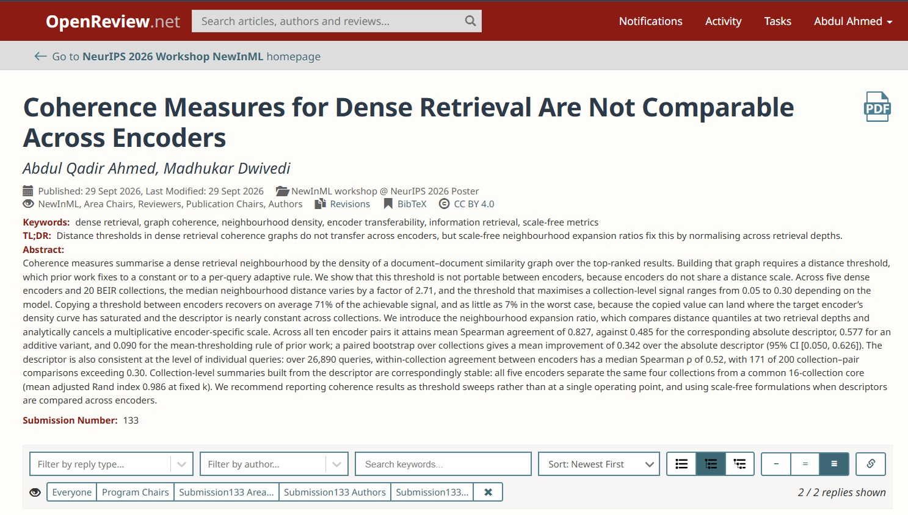
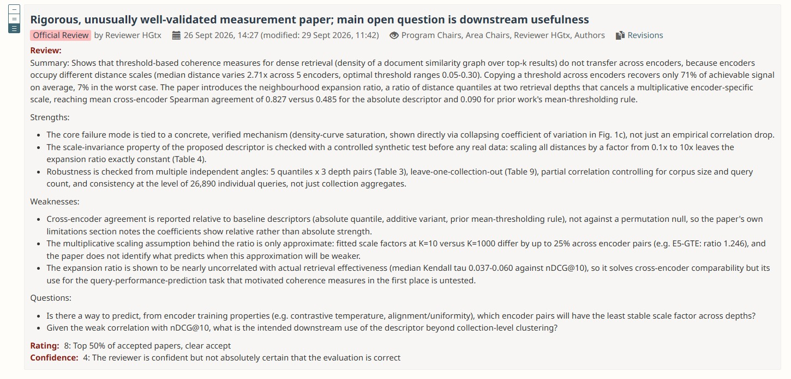

# Precomputed BEIR Embeddings: BGE-Large & E5-Large


<p align="center">
    <a href="https://huggingface.co">
        
    </a>
    <a href="https://github.com/beir-cellar/beir">
        
    </a>
    <a href="https://github.com/beir-cellar/beir/blob/master/LICENSE">
        
    </a>
</p>

<h4 align="center">
    <p>
        <a href="#what-is-it">Overview</a> |
        <a href="#quick-download--usage">Quick Usage</a> |
        <a href="#available-embedding-corpora">Datasets</a> |
        <a href="#citing">Citing</a>
    </p>
</h4>

---
## Abstract and Submitted Paper

Coherence measures summarise a dense retrieval neighbourhood by the density of a document--document similarity graph over the top-ranked results. Building that graph requires a distance threshold, which prior work fixes to a constant or to a per-query adaptive rule. We show that this threshold is not portable between encoders, because encoders do not share a distance scale. Across five dense encoders and 20 BEIR collections, the median neighbourhood distance varies by a factor of $2.71$, and the threshold that maximises a collection-level signal ranges from $0.05$ to $0.30$ depending on the model. Copying a threshold between encoders recovers on average $71\%$ of the achievable signal, and as little as $7\%$ in the worst case, because the copied value can land where the target encoder's density curve has saturated and the descriptor is nearly constant across collections. We introduce the \emph{neighbourhood expansion ratio}, which compares distance quantiles at two retrieval depths and analytically cancels a multiplicative encoder-specific scale. Across all ten encoder pairs it attains mean Spearman agreement of $0.827$, against $0.485$ for the corresponding absolute descriptor, $0.577$ for an additive variant, and $0.090$ for the mean-thresholding rule of prior work; a paired bootstrap over collections gives a mean improvement of $0.342$ over the absolute descriptor ($95\%$ CI $[0.050,0.626]$). The descriptor is also consistent at the level of individual queries: over $26{,}890$ queries, within-collection agreement between encoders has a median Spearman $\rho$ of $0.52$, with $171$ of $200$ collection--pair comparisons exceeding $0.30$. Collection-level summaries built from the descriptor are correspondingly stable: all five encoders separate the same four collections from a common 16-collection core (mean adjusted Rand index $0.986$ at fixed $k$). We recommend reporting coherence results as threshold sweeps rather than at a single operating point, and using scale-free formulations when descriptors are compared across encoders.

OpenReview Link->

https://openreview.net/login?redirect=/forum?id%3Dbm9NlCvRP9








## 📦 What is it?

This repository provides fully precomputed document embedding corpora for 25 retrieval collections from the BEIR benchmark (13 standalone collections and the 12 sub-datasets of CQADupStack), contributing back to the Information Retrieval (IR) community.

Generating these embeddings from scratch requires significant compute time and infrastructure. To help researchers, developers, and practitioners bypass this overhead, we are releasing the complete collection-specific representations generated using available models:

* BGE-Large (BAAI/bge-large-en-v1.5)
* E5-Large (intfloat/e5-large-v2)

These embeddings are tailored for tasks like constructing retrieval neighborhoods, evaluating representation spaces, late-interaction indexing, and semantic cohesion analyses.

---

## 📦 Quick Download & Usage

You can easily download and load the precomputed vectors into your Python pipeline using the huggingface_hub and numpy libraries.

```python
from huggingface_hub import hf_hub_download
import pickle

# Replace with your actual Hugging Face repository ID
repo_id = "your-username/beir-precomputed-embeddings"
dataset_name = "scifact"
model_name = "bge-large"  # or "e5-large"

# Download the precomputed pickle file generated by the script
pkl_path = hf_hub_download(repo_id=repo_id, filename=f"{model_name}/{dataset_name}/corpus_embeddings.pkl")

# Load data
with open(pkl_path, "rb") as f:
    data = pickle.load(f)

doc_ids = data["doc_ids"]
corpus_embeddings = data["doc_embeddings"]

print(f"Successfully loaded {len(doc_ids)} documents.")
print(f"Embedding matrix shape: {corpus_embeddings.shape}")

```

## 📦 Available Embedding Corpora

The table below outlines the 25 (13 + 12 subset) BEIR collections for which both BGE-Large and E5-Large document embedding matrices are provided.


# BEIR Precomputed Embeddings

Precomputed corpus embeddings for evaluation on the BEIR benchmark.

| Collection Name | BEIR Identifier | Type | Document Count | BGE-Large Link | E5-Large Link |
| :--- | :--- | :--- | :--- | :--- | :--- |
| TREC-COVID | `trec-covid` | Standalone | 171K | [Download](https://huggingface.co/datasets/2ahmedabdullah/beir-precomputed-embeddings/resolve/main/bge-large/trec-covid/trec_covid_corpus_embeddings_bge_large.pkl) | [Download](https://huggingface.co/datasets/2ahmedabdullah/beir-precomputed-embeddings/resolve/main/e5-large/trec-covid/trec_covid_corpus_embeddings_e5_large.pkl) |
| NFCorpus | `nfcorpus` | Standalone | 3.6K | [Download](https://huggingface.co/datasets/2ahmedabdullah/beir-precomputed-embeddings/resolve/main/bge-large/nfcorpus/nfcorpus_corpus_embeddings_bge_large.pkl) | [Download](https://huggingface.co/datasets/2ahmedabdullah/beir-precomputed-embeddings/resolve/main/e5-large/nfcorpus/nfcorpus_corpus_embeddings_e5_large.pkl) |
| NQ | `nq` | Standalone | 2.68M | [Download](https://huggingface.co/datasets/2ahmedabdullah/beir-precomputed-embeddings/resolve/main/bge-large/nq/nq_corpus_embeddings_bge_large.pkl) | [Download](https://huggingface.co/datasets/2ahmedabdullah/beir-precomputed-embeddings/resolve/main/e5-large/nq/nq_corpus_embeddings_e5_large.pkl) |
| HotpotQA | `hotpotqa` | Standalone | 5.23M | [Download](https://huggingface.co/datasets/2ahmedabdullah/beir-precomputed-embeddings/resolve/main/bge-large/hotpotqa/hotpotqa_corpus_embeddings_bge_large.pkl) | [Download](https://huggingface.co/datasets/2ahmedabdullah/beir-precomputed-embeddings/resolve/main/e5-large/hotpotqa/hotpotqa_corpus_embeddings_e5_large.pkl) |
| FiQA-2018 | `fiqa` | Standalone | 57K | [Download](https://huggingface.co/datasets/2ahmedabdullah/beir-precomputed-embeddings/resolve/main/bge-large/fiqa/fiqa_corpus_embeddings_bge_large.pkl) | [Download](https://huggingface.co/datasets/2ahmedabdullah/beir-precomputed-embeddings/resolve/main/e5-large/fiqa/fiqa_corpus_embeddings_e5_large.pkl) |
| ArguAna | `arguana` | Standalone | 8.67K | [Download](https://huggingface.co/datasets/2ahmedabdullah/beir-precomputed-embeddings/resolve/main/bge-large/arguana/arguana_corpus_embeddings_bge_large.pkl) | [Download](https://huggingface.co/datasets/2ahmedabdullah/beir-precomputed-embeddings/resolve/main/e5-large/arguana/arguana_corpus_embeddings_e5_large.pkl) |
| Touche-2020 | `webis-touche2020` | Standalone | 382K | [Download](https://huggingface.co/datasets/2ahmedabdullah/beir-precomputed-embeddings/resolve/main/bge-large/webis-touche2020/webis-touche2020_corpus_embeddings_bge_large.pkl) | [Download](https://huggingface.co/datasets/2ahmedabdullah/beir-precomputed-embeddings/resolve/main/e5-large/webis-touche2020/webis-touche2020_corpus_embeddings_e5_large.pkl) |
| Quora | `quora` | Standalone | 523K | [Download](https://huggingface.co/datasets/2ahmedabdullah/beir-precomputed-embeddings/resolve/main/bge-large/quora/quora_corpus_embeddings_bge_large.pkl) | [Download](https://huggingface.co/datasets/2ahmedabdullah/beir-precomputed-embeddings/resolve/main/e5-large/quora/quora_corpus_embeddings_e5_large.pkl) |
| DBpedia | `dbpedia-entity` | Standalone | 4.63M | [Download](https://huggingface.co/datasets/2ahmedabdullah/beir-precomputed-embeddings/resolve/main/bge-large/dbpedia-entity/dbpedia-entity_corpus_embeddings_bge_large.pkl) | [Download](https://huggingface.co/datasets/2ahmedabdullah/beir-precomputed-embeddings/resolve/main/e5-large/dbpedia-entity/dbpedia-entity_corpus_embeddings_e5_large.pkl) |
| SCIDOCS | `scidocs` | Standalone | 25K | [Download](https://huggingface.co/datasets/2ahmedabdullah/beir-precomputed-embeddings/resolve/main/bge-large/scidocs/scidocs_corpus_embeddings_bge_large.pkl) | [Download](https://huggingface.co/datasets/2ahmedabdullah/beir-precomputed-embeddings/resolve/main/e5-large/scidocs/scidocs_corpus_embeddings_e5_large.pkl) |
| FEVER | `fever` | Standalone | 5.42M | [Download](https://huggingface.co/datasets/2ahmedabdullah/beir-precomputed-embeddings/resolve/main/bge-large/fever/fever_corpus_embeddings_bge_large.pkl) | [Download](https://huggingface.co/datasets/2ahmedabdullah/beir-precomputed-embeddings/resolve/main/e5-large/fever/fever_corpus_embeddings_e5_large.pkl) |
| Climate-FEVER | `climate-fever` | Standalone | 5.42M | [Download](https://huggingface.co/datasets/2ahmedabdullah/beir-precomputed-embeddings/resolve/main/bge-large/climate-fever/climate-fever_corpus_embeddings_bge_large.pkl) | [Download](https://huggingface.co/datasets/2ahmedabdullah/beir-precomputed-embeddings/resolve/main/e5-large/climate-fever/climate-fever_corpus_embeddings_e5_large.pkl) |
| SciFact | `scifact` | Standalone | 5K | [Download](https://huggingface.co/datasets/2ahmedabdullah/beir-precomputed-embeddings/resolve/main/bge-large/scifact/scifact_corpus_embeddings_bge_large.pkl) | [Download](https://huggingface.co/datasets/2ahmedabdullah/beir-precomputed-embeddings/resolve/main/e5-large/scifact/scifact_corpus_embeddings_e5_large.pkl) |

### CQADupStack Subsets
For the CQADupStack collection, the embeddings are split by the 12 individual subsets:

| Collection Name | BEIR Identifier | Type | Document Count | BGE-Large Link | E5-Large Link |
| :--- | :--- | :--- | :--- | :--- | :--- |
| Android | `cqadupstack` | Subset | 23K | [Download](https://huggingface.co/datasets/2ahmedabdullah/beir-precomputed-embeddings/resolve/main/bge-large/CQADupstack/android/android_corpus_embeddings_bge_large.pkl) | [Download](https://huggingface.co/datasets/2ahmedabdullah/beir-precomputed-embeddings/resolve/main/e5-large/CQADupstack/android/android_corpus_embeddings_e5_large.pkl) |
| English | `cqadupstack` | Subset | 40K | [Download](https://huggingface.co/datasets/2ahmedabdullah/beir-precomputed-embeddings/resolve/main/bge-large/CQADupstack/english/english_corpus_embeddings_bge_large.pkl) | [Download](https://huggingface.co/datasets/2ahmedabdullah/beir-precomputed-embeddings/resolve/main/e5-large/CQADupstack/english/english_corpus_embeddings_e5_large.pkl) |
| Gaming | `cqadupstack` | Subset | 45K | [Download](https://huggingface.co/datasets/2ahmedabdullah/beir-precomputed-embeddings/resolve/main/bge-large/CQADupstack/gaming/gaming_corpus_embeddings_bge_large.pkl) | [Download](https://huggingface.co/datasets/2ahmedabdullah/beir-precomputed-embeddings/resolve/main/e5-large/CQADupstack/gaming/gaming_corpus_embeddings_e5_large.pkl) |
| GIS | `cqadupstack` | Subset | 38K | [Download](https://huggingface.co/datasets/2ahmedabdullah/beir-precomputed-embeddings/resolve/main/bge-large/CQADupstack/gis/gis_corpus_embeddings_bge_large.pkl) | [Download](https://huggingface.co/datasets/2ahmedabdullah/beir-precomputed-embeddings/resolve/main/e5-large/CQADupstack/gis/gis_corpus_embeddings_e5_large.pkl) |
| Mathematica | `cqadupstack` | Subset | 17K | [Download](https://huggingface.co/datasets/2ahmedabdullah/beir-precomputed-embeddings/resolve/main/bge-large/CQADupstack/mathematica/mathematica_corpus_embeddings_bge_large.pkl) | [Download](https://huggingface.co/datasets/2ahmedabdullah/beir-precomputed-embeddings/resolve/main/e5-large/CQADupstack/mathematica/mathematica_corpus_embeddings_e5_large.pkl) |
| Physics | `cqadupstack` | Subset | 38K | [Download](https://huggingface.co/datasets/2ahmedabdullah/beir-precomputed-embeddings/resolve/main/bge-large/CQADupstack/physics/physics_corpus_embeddings_bge_large.pkl) | [Download](https://huggingface.co/datasets/2ahmedabdullah/beir-precomputed-embeddings/resolve/main/e5-large/CQADupstack/physics/physics_corpus_embeddings_e5_large.pkl) |
| Programmers | `cqadupstack` | Subset | 32K | [Download](https://huggingface.co/datasets/2ahmedabdullah/beir-precomputed-embeddings/resolve/main/bge-large/CQADupstack/programmers/programmers_corpus_embeddings_bge_large.pkl) | [Download](https://huggingface.co/datasets/2ahmedabdullah/beir-precomputed-embeddings/resolve/main/e5-large/CQADupstack/programmers/programmers_corpus_embeddings_e5_large.pkl) |
| Stats | `cqadupstack` | Subset | 42K | [Download](https://huggingface.co/datasets/2ahmedabdullah/beir-precomputed-embeddings/resolve/main/bge-large/CQADupstack/stats/stats_corpus_embeddings_bge_large.pkl) | [Download](https://huggingface.co/datasets/2ahmedabdullah/beir-precomputed-embeddings/resolve/main/e5-large/CQADupstack/stats/stats_corpus_embeddings_e5_large.pkl) |
| TeX | `cqadupstack` | Subset | 68K | [Download](https://huggingface.co/datasets/2ahmedabdullah/beir-precomputed-embeddings/resolve/main/bge-large/CQADupstack/tex/tex_corpus_embeddings_bge_large.pkl) | [Download](https://huggingface.co/datasets/2ahmedabdullah/beir-precomputed-embeddings/resolve/main/e5-large/CQADupstack/tex/tex_corpus_embeddings_e5_large.pkl) |
| Unix | `cqadupstack` | Subset | 47K | [Download](https://huggingface.co/datasets/2ahmedabdullah/beir-precomputed-embeddings/resolve/main/bge-large/CQADupstack/unix/unix_corpus_embeddings_bge_large.pkl) | [Download](https://huggingface.co/datasets/2ahmedabdullah/beir-precomputed-embeddings/resolve/main/e5-large/CQADupstack/unix/unix_corpus_embeddings_e5_large.pkl) |
| Webmasters | `cqadupstack` | Subset | 17K | [Download](https://huggingface.co/datasets/2ahmedabdullah/beir-precomputed-embeddings/resolve/main/bge-large/CQADupstack/webmasters/webmasters_corpus_embeddings_bge_large.pkl) | [Download](https://huggingface.co/datasets/2ahmedabdullah/beir-precomputed-embeddings/resolve/main/e5-large/CQADupstack/webmasters/webmasters_corpus_embeddings_e5_large.pkl) |
| Wordpress | `cqadupstack` | Subset | 49K | [Download](https://huggingface.co/datasets/2ahmedabdullah/beir-precomputed-embeddings/resolve/main/bge-large/CQADupstack/wordpress/wordpress_corpus_embeddings_bge_large.pkl) | [Download](https://huggingface.co/datasets/2ahmedabdullah/beir-precomputed-embeddings/resolve/main/e5-large/CQADupstack/wordpress/wordpress_corpus_embeddings_e5_large.pkl) |


## 📦 Citing

Citing the official BEIR benchmark paper:

```
@inproceedings{
    thakur2021beir,
    title={{BEIR}: A Heterogeneous Benchmark for Zero-shot Evaluation of Information Retrieval Models},
    author={Nandan Thakur and Nils Reimers and Andreas R{\"u}ckl{\'e} and Abhishek Srivastava and Iryna Gurevych},
    booktitle={Thirty-fifth Conference on Neural Information Processing Systems Datasets and Benchmarks Track (Round 2)},
    year={2021},
    url={[https://openreview.net/forum?id=wCu6T5xFjeJ](https://openreview.net/forum?id=wCu6T5xFjeJ)}
}

```

### Next Steps to Launch:
1. Create a dataset or model repository on Hugging Face (e.g., `your-username/beir-precomputed-embeddings`). *Note: Hugging Face "Datasets" repositories are usually ideal for large binary/array files.*
2. Upload your `corpus_embeddings.pkl` files into folders matching the exact directory structure expected by the code (`bge-large/<dataset>/corpus_embeddings.pkl` and `e5-large/<dataset>/corpus_embeddings.pkl`).
3. Replace `"your-username/beir-precomputed-embeddings"` in the Python snippet with your actual repository ID!


## Collaboration
The BEIR Benchmark Embeddings has been made possible due to a collaborative effort of the following universities and organizations:


## Contributors

Thanks to all these wonderful collaborations for their contribution towards the BEIR benchmark precomputed embeddings:

<table>
  <tr>
    <td align="center">
      <a href="https://github.com/2ahmedabdullah">
        
        <br />
        <sub><b>Abdul Ahmed</b></sub>
      </a>
    </td>
    <td align="center">
      <a href="https://www.linkedin.com/in/madhukar-dwivedi-42748b145/">
        
        <br />
        <sub><b>Madhukar Dwivedi</b></sub>
      </a>
    </td>
  </tr>
</table>
